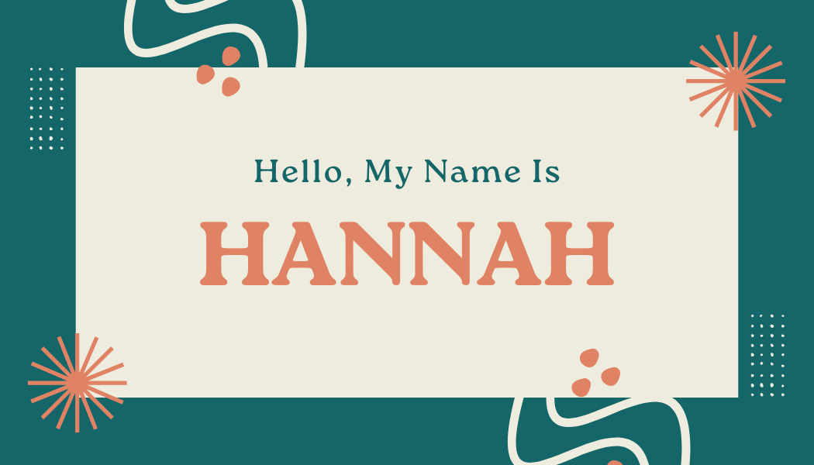

Hi there!

I am Hannah, a third year UX/Dev student studying at Open Window.

Want to know more about me? [Check out my portfolio on GitHub](https://github.com/HannahAmaria), and on [Behance](https://www.behance.net/hannahnaidoo1).

 

## 📌 Pinned Repositories

 

 

 

 

 

## &#x1f4c8; GitHub Statistics

 

 
 

## 💼 Skills

More Skills

 

## Contact Details

Student: 21100366@virtualwindow.co.za

Personal: hannahamarian@gmail.com
 

## Reference

Template by [Braydon Coyer](https://github.com/braydoncoyer/braydoncoyer)
